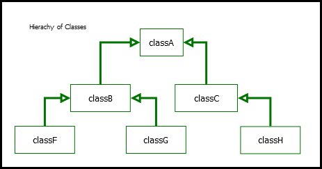
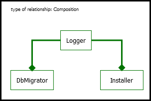
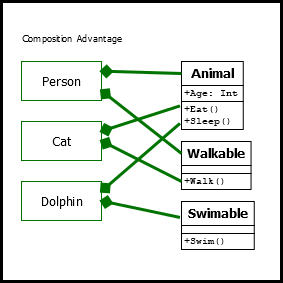
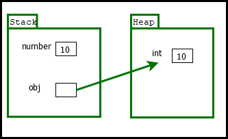

# C# Intermediate Documentation

## Table of Contents

- [C# Intermediate Documentation](#c-intermediate-documentation)
  - [Classes](#classes)
  - [Constructor](#constructor)
    - [Overloading ](#overloading-)
  - [Methods](#methods)
    - [params modifier](#params-modifier)
    - [ref modifier ](#ref-modifier-)
    - [out modifier](#out-modifier)
  - [Fields](#fields)
  - [Access Modifiers ](#access-modifiers-)
    - [Getters and Setters](#getters-and-setters)
  - [Properties](#properties)
  - [Indexers](#indexers)
  - [Asociation between classes](#asociation-between-classes)
    - [class coupling](#class-coupling)
    - [Inheritance](#inheritance)
    - [Composition](#composition)
    - [Favour Composition over Inheritance](#favour-composition-over-inheritance)
  - [Access modifiers](#access-modifiers)
  - [Solutions and Proejcts in VS](#solutions-and-proejcts-in-vs)
  - [Upcasting and Downcasting](#upcasting-and-downcasting)
  - [Boxing and Unboxing](#boxing-and-unboxing)
  - [Polymorphism - Method Overriding](#polymorphism---method-overriding)
  - [Polymorphism - Abstract Classes and Members](#polymorphism---abstract-classes-and-members)
  - [Documentation](#documentation)
  - [Notes](#notes)
  - [exercises folders](#exercises-folders)
    - [Exercise 1 (Fields and Methods)](#exercise-1-fields-and-methods)
    - [Exercise 2 (Composition)](#exercise-2-composition)
    - [Exercise 3 (Inheritance)](#exercise-3-inheritance)
    - [Exercise 4 (Polymorphism)](#exercise-4-polymorphism)
    - [Exercise 5 - (Interfaces)](#exercise-5---interfaces)


## Classes

- classes are building blocks of an app
- classes encapsulates data (fields) and behaviour (methods)
    - 
    ```cs
    public class Customer
    {
        // this is a field
        public string Username;

        // this is a method
        public void ShowStatus()
        {
            // code
        }
    }
    ```
- objects is an instance of a class
- objects can be created using the keyword (reserved word) "new"
    - `Customer customer = new Customer();`
    - `var customer = new Customer();`

- declaracion should be Pascal notation (upper case letter at the beggining)
    - Example: `Person`

- `static` members are normally only 1 element (singleton) like Console.

- classes should never lie, they cannot be in a invalid state


## Constructor

- ctor is not inherited, and it's always executed first
- is a method that is called when the an instance of a class is created
- used to defined an initial or early state of the instance
- the best practice is to define the constructor only when it must be defined (to be able to perform its job)
- must have the same name that the class (or compiler will not recognize it as ctor)
- ctors do not have void type nor returns
- ctors can be overloaded (meaning, creating a method with the same name and different signatures)
- signatures are the number, type and order of its parameters
- can pass control from one constructor to other using the `this` keyword
- Example
    ```cs
    public class Customer 
    {
        public int Id;
        public string Name;
        public List<Order> Orders;
        // Default or parameterless constructor
        public Customer()
        {
            // Orders has to be initialized here, otherwise it
            // will be a null reference. As a best practice,
            // anytime your class contains a list, always
            // initialize the list
            Orders = new List<Order>();
        }

        public Customer(int id)
            : this() // Calls the default constructor
        {
            this.Id = id;
        }
    }
    ```

### Overloading 

- having multiple constructores with a different number of parameters
- 

## Methods

- signature of methods are:
    - number of parameters
    - type of parameters
    - order of parameters

- overloading methods means that having methods with the same name but different signatures

- Example
    ```cs
    public class Point
    {
        public void Move(int x, int y) {}
        public void Move(Point newLocation) {}
        public void Move(Point newLocation, int, speed) {}
    }
    ``` 
    
### params modifier

- the `params` modifier provide the ability to receive a different number of parameters
- Example
    ```cs
    public class Calculator
    {
        public int Add(params int[] numbers) {}
    }
    ```
    ```cs
    var result = calculator.Add(11, 2, 3, 9);
    ```

### ref modifier 

- the `ref` modifier can be use to send the original value to a method (by reference) and can be modified.
    - the opposite is send a copy (no ref is normally the recommended case because the variable cannot be modified, only when it's returned from the method, like a blackbox)
    - `ref ` is not too recommended

    ```cs
    public void MethodWithRef(ref int x)
    {      
        x += 2;
    } 
    var x = 1;
    MethodWithRef(ref x); // x will be 3 here
    ```

### out modifier

- the `out` modifier can be used to return multiple values from a method
- the `out` modifier of parameters, is expected to receive a value at the end of the method

    ```cs
    public void MethodWithOut(out int a)
    {
        a = 1;
    } 
    int a;
    MethodWithOut(out a);
    ```

## Fields

- is like a variable used to store data in a class
- initialization
    - can be in a constructor
    - can be in a declaration
    - Example
        ```cs
        public class Customer
        {
            public List<Order> Orders = new List<Order>();
        }
        ```

- `readonly` modifier prevents from accidental overwriting the value of a field (which can cause unwanted changes in states)
    - Example
        - 
        ```cs
        public class Customer
        {
            public readonly List<Order> Orders = new List<Order>();
        }
        ```
        - from:
        `public List<Order> Orders = new List<Order>();`

- if a field is declared one more time, 


## Access Modifiers 

- modifiers are used to hide the implementation details of a class and avoid other parts of the code modify class implementations
- it provides robustsnetss (if a change is required, then only can be changed inside of the class)
- there are 5 access modifiers
    1. public
        - class is accessible everywhere
    2. private
        - class is accessible only from inside the class
    3. protected
        - 
    4. internal
    5. protected internal

- Naming conventions: 
    - Pascal Case: `UserIsAuthenticated` (classes, methods)
    - Camel Case: `userName`, `_name` (*private* fields should start with a underscore _)

### Getters and Setters

- Example:
    ```cs
    public class Person
    {
        private string Name;

        public void SetName(string name)
        {
            if (!String.IsNullOrEmpty(name))
                this.Name = name;;
        }

        public String GetName()
        {
            return Name;
        }
    }
    ```


## Properties

- a class member that encapsulates a getter and setter for accessing a field
- is a class member that is used to access to fields of a class
- as a best practice, need to create setters and getters to modify or access properties, and avoid direct access (properties should be private)
- Example
    ```cs
    public class Customer
    {
        private string _name;
        public string Name
        {
            get { return _name; }
            set { _name = value; }
        }
    }
    ```
- in get and set, thre can be some logic
- if logic is not required in `get` and `set`, then by default the encapsulated (auto-generated) option can be used:

    ```cs
    public class Customer
    {
        public string Name { get; set; }
    }
    ```

## Indexers

- Is a way to access elements in a class that represents a list of values
- elements like properties but are accessible using an index
- we can define a property or an indexer when a class has a semantic of a list, or a collection
- With indexes is easier to get or set items in the collection

- Example
    - To use this:
    ```cs
    var cookie = new HttpCookie();
    cookie["name"] = "Jamecho";
    ```
    - must be declared like this:
    ```cs
        public string this[string key]
        {
            get { return _dictionary[key]; }
            set { _dictionary[key] = value; }
        }
    ```


## Asociation between classes

### class coupling

- measure of how interconnected classes and suvbsystems are
- An App are classes that are packed in namespaces and assemblies
- Example of coupling
    - tightly coupled
        - changing the top hierarchy class A, could modify classB and classF, and at the same time, those might modify subclasses, and so on, this is not ideal, changing 1 class cannot change their subclasses.
    - loosely coupled
        - ideally a change in a class, should not imply to modify the sub classes, so they should be *loosely coupled*

- How to design loosely coupling?
    - Encapsulation (responsabilities of each class)
    - Relationship between classes (Inheritance and composition)
    - Interfaces


### Inheritance

- Inheritance: Relationship between 2 classes that allows one to inherit code from another class
    - Is used  because allows to re-use code
    - Is used because allows polymorphic behaviour

- in UML, there are classes that points to an upper (superclass) class, with a regular arrow
- 
    ```cs
    public class PresentationObject
    {
        //code
    }

    public class Text: PresentationObject
    {
        // code
    }
    ```
- in C# a class can have only 1 parent class
- the `Object` class is the parent class of all classes in Csharp
- the classB `is a` ClassA (the Auto `is a` Car) *is a relationship*
- Examples in forlder `inheritance1`
- UML diagram:
    - 
        - classB, classC, inherits from classA. 
        - classA, encapsulates common fields and behaviour
        - classA is a *Parent* class or *Base Class* or *Superclass*
        - classB and classC, are *Child* classes or *Derived Classes* or *Subclasses*
        

### Composition

- composition is another relation between classes that allows to contain one into another
- - the classB `has a` ClassA (the Auto `has a` engine) *has a relationship*
- composition is used because allows re-use, is flexible and helps to achieve loose-coupling relationships
- is more flexible, meaning `loose-coupling`

- Example in folder `composition1` (this is way many prefer Favour Composition over Inheritance)
    - Composition
    ```cs
    public class Installer
    {
        private Logger _logger;

        public Installer (Logger logger)
        {
            _logger = logger;
        }
    }
    ```
- 
    - logger class with loggin capability and use that class in `Migrate()` and `Installer()`


### Favour Composition over Inheritance

- Inheritance can be abused by creating large hierarchy
- is thightly coupling, and that is fragile
- Problems with inheritance
    - Easily abused
    - Leads to large complex hierarchies (such hierarchies are very fragile and a change may affect many classes)
    - Results in tight coupling (which in most cases is not desirable)

- Benefits of composition
    - Flexible
    - Leads to loose-coupling (which is desirable)

- it doesn’t mean inheritance should be avoided at all times. 
    - it’s great to use inheritance when dealing with very stable classes on top of small hierarchies
    - As the hierarchy grows (or variations of classes increase)
    - the hierarchy may become fragile
    - that’s where composition can provide a better design

- in summary:
    - 2 types of relationship  between classes
        - Inheritance (Is-a)
        - Composition (Has-a)

- in UML, composition benefits:
    - 
        - Using composition, it's easier to grow the system, without affecting the other classes
        - If another class is required, let's say, "JumpAble()" would be easier, just like "SwimAble()"
        - In this case, we say "*Person* has an *Animal*" (**has a** is Composition)
        - In this case, we say "*Cat* has an *Animal*" 
        - In **inheritance**, it would "Person": **is an** animal 
        - So, conceptually is different from the real-world, think in **Objects**


## Access modifiers

- Public, accessible everywhere
- Private, accessible only from the class
- Protected, accessibly only from the class and its **derived** classes
    - Protected breaks encapsulation (because the implementation details of a class will leak into its derived classes) and is better to be avoided
- Internal, accessibly only from the same assembly
- Protected Internal, declared as protected internal is accessible only from the same assembly or any derived classes


- Constructors are not inherited and need to explicitly defined in derived class
- When creating an object of a type that is part of an inheritance hierarchy, base class constructors are always executed first
- the `base` keyword can be used to pass control to a base class constructor
    ```cs
    public class Car : Vehicle 
    {
        public Car(string registration) : base(registration){ }
    }
    ```

- Example:
    - in the following code, the method "CalculateRating()" is public and can be used freely.
    - if for some reason, a change is made in the definition, then the code will have to be adjusted accordingly in many places and that is not desirable.
    - making the method private, will prevent it, will guarantee the encapsulation and only 1 change will have to be made.

    ```cs
    namespace AccessModifiers
    {
        public class Customer
        {
            public int Id { get; set; }
            public string Name { get; set; }

            public void Promote()
            {
                var rating = CalculateRating();
                if (rating == 0)
                    Console.WriteLine("Ok 1");
                else
                    Console.WriteLine("Nope 2");
            }

            public int CalculateRating()
            {
                return 0;
            }
        }
        class Program
        {
            static void Main(string[] args)
            {
                var customer = new Customer();
                customer.CalculateRating();
            }
        }
    }
    ```

    - so the implementation should be:
        ```cs
            private int CalculateRating()
            {
                return 0;
            }
        ```


## Solutions and Proejcts in VS

- with a **Class library** we create a DLL (Dynamically Link Library)
    - in the same solution, right click and add a Class Library
    - the namespace could be different (press **Alt + Enter** OR **Ctrl + .** to update)
- Basically, a solution may contain one or  more projects


## Upcasting and Downcasting

- **Upcasting** is convert a class from a derived class to a base class
    - In programming, upcasting is similar. It's when you treat a more specialized object as if it were a more general object
- **Downcasting** is convert a class from a base class to a derived class
    -  It's when you treat a more general object as if it were a more specialized object. You're moving down the hierarchy
- Keywords: **as** and **is**
- From the following classes:
    - 
        ```cs
        public class Shape
        {
        }

        public class Circle : Shape
        {
        }
        ```
    - Upcasting example (implicit):
        ```cs
        Circle circle = new Circle();
        Shape shape = circle;
        ```

    - Downcasting example:
        ```cs
        Circle circle = new Circle();
        Shape shape = circle;

        Circle anotherCircle = (Circle)Shape; // this is an explicit casting  - invalidCastException - is resolved wit hthe "as" keyword
        ```
    - the **as** keyword
        ```cs
        Car car = (car) obj; // this will return invalidCastException

        Car car = obj as Car; // here, will return null instead of an exception
        if (car != null)
        {
            ...
        }
        ```
    - the **is** keyword
        ```cs
        if (obj is Car) // checks if obj is Car.
        {
            Car car = (Car) obj);
        }
        ```

- To open the object browser in VS: View > Object Browser
    - run app in debig mode: F5, and then press F10 (is a good way to observe objects and their content)
        ```cs
            static void Main(string[] args)
            {
                // Example 1:
                // this is upcasting
                // here text and shape point to the same object, but the have different views (different properties available)
                // shape will have less properties available than text
                // text will have more properties available than shape
                Text text = new Text();
                Shape shape = text;
                text.Width = 200;
                shape.Width = 100;
                System.Console.WriteLine(text.Width); // 100, they are pointing to the same object

                // Example 2:
                // int this case, the base class Stream, is the parent class of the class FileStream and MemoryStream (view > Object Explorer)
                // it can be declared like this (using one of the several overloads):
                // StreamReader reader = new StreamReader(new FileStream());
                // StreamReader reader = new StreamReader(new MemoryStream());
                // no need explicit casting
                
                // Example 3:
                // ArrayList is not ideal, because it accepts all types
                var list = new ArrayList();
                list.Add(1);
                list.Add("Jamecho");
                list.Add(new Text());
                // following is a generic list, it prevents to cast, and all members will be Shape type (or int, string, etc)
                var anotherList = new List<Shape>();

                // Example 4:
                // Downcasting
                Shape shape2 = new Text();
                // up here shape2 is a text object, but does not have the text properties
                Text text2 = (Text)shape2;
                // now text2 will have access the text properties

                // Example 5: 
                // Downcasting
                private void Button_Click(object sender, RoutedEventArgs e)
                {
                    // Subexample 1
                    // sender will not have access to the bottom properties and methods
                    // so need to downcast, to provide access to methods of the bottom class
                    // in this case is safe to cast like this, because we are sure that Button_Click comes from Button
                    var button = (Button) sender;

                    // // Subexample 2
                    // using the keyword "as"
                    // If we are not sure that Button_Click comes from Button, the use the as keyword
                    var button = sender as Button;
                    if (button != null)
                    {
                        MessageBox.Show(button.ActualHeight.ToString());
                    }
                    MessageBox.Show("Hallo, Welt!");
                }

            }
        ```

- Examples in [csharp-general-all/Casting.cs]


## Boxing and Unboxing

- Types are divided in 2: Value Type and Reference Types

- Value Types
    - int, byte, float, char, bool
    - Stored in the **Stack** ()
    - as soon as they go out of the scope, the system just remove them

- Reference Types
    - Are stored in the Heap (larger amount of memory)
    - Requires a longer tifetime
    - Object, Array, String, any classes.

- the **Object** class is the base of all classes in the dotnet framework

- Boxing has a penalty performace

- **boxing** is the process of converting a value type instance to an object reference
    - Example
        ```cs
        int number = 10;
        object obj = number;
        // or
        object obj = 10;
        ```
    - the value get boxed by the CLR and gets stored in the heap, instead of the stack
        - 

- **unboxing** has a performance penalty
    - Example:
        ```cs
        object obj = 10;
        int number = (int)obj;
        ```

- Example
    ```cs
    Circle circle = new Circle();
    Shape shape = circle;
    object shape = circle;
    ```
    
- Lesson:
    - if calling a method, and the methods gets an argument of type object, if pass a value type, then boxing is gonna happen.
    - better to use the generic implementation if exists


## Polymorphism - Method Overriding


- Changing/Modifying the implementation of an inherited method (different from overloading methods)
- Example, Circle may draw different from Image:
    ```cs
    public class Shape 
    {
        public Draw() { }
    }

    public class Circle : Shape {}

    public class Image : Shape {}
    ```
    - to something like this:
    ```cs
    public class Shape 
    {
        public virtual void Draw()
        { 
            // default implementation
        }
    }

    public class Circle : Shape 
    {
        public override void Draw()
        { 
            // new implementation
        }
    }
    
    ```


## Polymorphism - Abstract Classes and Members

- 


## Interfaces

- Declaration use the keyword interface
- an Interfaces name, starts with an 'I', eg. `IPayCalc`
- Methods do not have implementation, only 
- Interface members do not have access modifiers
- Interfaces are created to built loosely coupled applications
- Making a change is much easier with low or zero impact to other classes
- Syntax:
    ```cs
    public interface IPayCalculator
    {
        int Calculate();
    }
    ```
- As long as the interfaces is not changed, no changes will happen to the classes that implements the interface
- [IMPORTANT] If a change is required in the class, we can create a class that implements the interface


## IEnumerable, ICollection and List

- List is full Featured
    - ICollection is in the middle
    - IEnumerable less methods
    
~~~mermaid
flowchart
	List -- then --> ICollection
	ICollection -- then --> IEnumerable
~~~


## Documentation


## Notes


## exercises folders


### Exercise 1 (Fields and Methods)

- Design a class called Stopwatch, its job is to simulate a stopwatch
- It should provide two methods: Start and Stop calling the start method first, and the stop method next
- Then ask the stopwatch about the duration between start and stop (Duration should be a value in TimeSpan, and display the duration on the console)
- It should also be able to use a stopwatch multiple times (may start and stop it and then start and stop it again)
- Make sure the duration value each time is calculated properly
- We should not be able to start a stopwatch twice in a row (because that may overwrite the initial start time). So the class should throw an InvalidOperationException if its started twice
    - The aim of this exercise is to make you understand that a class should be always in a valid state
    - We use encapsulation and information hiding to achieve the result
    - The class should not reveal its implementation detail, like a blackbox
    - From the outside, you should not be able to misuse a class because you shouldn’t be able to see the implementation details

- solution, in repo [**/csharp-general-all/tree/main/StopWatch_moshham**]


### Exercise 2 (Composition)

- Design a class called Post.
- This class models a StackOverflow post
- It should have properties for title, description and the date/time it was created
- We should be able to up-vote or down-vote a post
- We should also be able to see the current vote value
- In the main method, create a post, up-vote and down-vote it a few times and then display the the current vote value
- In this exercise, you will learn that a StackOverflow post should provide methods for up-voting and down-voting
- You should not give the ability to set the Vote property from the outside, because otherwise, you may accidentally change the votes of a class to 0 or to a random number. And this is how we create bugs in our programs
- The class should always protect its state and hide its implementation detail
    - The aim of this exercise is to help to understand that classes should encapsulate data AND behaviour around that data
    - Many developers (even those with years of experience) tend to create classes that are purely data containers, and other classes that are purely behaviour (methods) providers
    - This is not object-oriented programming. This is procedural programming. Such programs are very fragile. Making a change breaks many parts of the code

- solution, in repo [**/csharp-general-all/tree/main/PostStOverFlow_moshham**]


### Exercise 3 (Inheritance)

- A Stack is a data structure for storing a list of elements in a LIFO (last in, first out) fashion
- Design a class called Stack with three methods. 
    ```cs
    void Push(object obj)
    object Pop()
    void Clear()
    ```

- The `Push()` method stores the given object on top of the stack. We use the “object” type here so we can store any objects inside the stack. 

- Remember the “object” class is the base of all classes in the .NET Framework. 

- So any types can be automatically upcast to the object. Make sure to take into account the scenario that null is passed to this object. 
- We should not store null references in the stack. So if null is passed to this method, you should throw an InvalidOperationException. 
- Remember, when coding every method, you should think of all possibilities and make sure the method behaves properly in all these edge cases. That’s what distinguishes you from an “average” programmer.
- The Pop() method removes the object on top of the stack and returns it. 
- Make sure to take into account the scenario that we call the Pop() method on an empty stack. 

- In this case, this method should throw an InvalidOperationException. Remember, your classes should always be in a valid state and used properly.
- When they are misused, they should throw exceptions. Again, thinking of all these edge cases, separates you from an average programmer. 

- The code written this way will be more robust and with less bugs

-  The Clear() method removes all objects from the stack. We should be able to use this stack class as follows

    ```cs
    var stack = new Stack();
    stack.Push(1);
    stack.Push(2);
    stack.Push(3);
    Console.WriteLine(stack.Pop());
    Console.WriteLine(stack.Pop());
    Console.WriteLine(stack.Pop());
    ```

- The output of this program will be 
    - 3
    - 2
    - 1

- Note: The downside of using the object class here is that if we store value types (eg int, char, bool, DateTime) in our Stack, boxing and unboxing occurs, which comes with a small performance penalty

- In my C# Advanced course, I’ll teach you how to resolve this by using generics, but for now don’t worry about it.

- Real-world use case: Stacks are very popular in real-world applications. 
- Think of your browser. As you navigate the web, the address of each page you visit is stored in a stack. As you click the Back button, the most recent address is popped. This is because of the LIFO behaviour of stacks. 3

- **solution**, in repo [**csharp-intermediate/tree/main/ExerciseCasting**]


### Exercise 4 - Polymorphism 1st - (Design a database connection)

- To access a database, we need to open a connection to it first and close it once our job is done. Connecting to a database depends on the type of the target database and the database management system (DBMS).
- For example, connecting to a SQL Server database is different from connecting to an Oracle database.
- But both these connections have a few things in common: •They have a connection string •They can be opened•They can be closed•They may have a timeout attribute (so if the connection could not be opened within the timeout, an exception will be thrown).Your job is to represent these commonalities in a base class called DbConnection. This class should have two properties: ConnectionString : stringTimeout : TimeSpanA DbConnection will not be in a valid state if it doesn’t have a connection string. So you need to pass a connection string in the constructor of this class. Also, take into account the scenarios where null or an empty string is sent as the connection string. Make sure to throw an exception to guarantee that your class will always be in a valid state.Our DbConnection should also have two methods for opening and closing a connection. We don’t know how to open or close a connection in a DbConnection and this should be left to the classes that derive from DbConnection. These classes (eg SqlConnection or OracleConnection) will provide the actual implementation. So you need to declare these methods as abstract.Derive two classes SqlConnection and OracleConnection from DbConnection and provide a simple implementation of opening and closing connections using Console.WriteLine(). In the real-world, SQL Server provides an API for opening or closing a connection to a database. But for this exercise, we don’t need to worry about it. 


### Exercise 4 - Polymorphism 2nd - (Design a database command)

- Now that we have the concept of a DbConnection, let’s work out how to represent a DbCommand.
- Design a class called DbCommand for executing an instruction against the database. 
- A DbCommand cannot be in a valid state without having a connection. So in the constructor of this class, pass a DbConnection.
- Don’t forget to cater for the null.Each DbCommand should also have the instruction to be sent to the database. In case of SQL Server, this instruction is expressed in T-SQL language. Use a string to represent this instruction. Again, a command cannot be in a valid state without this instruction. So make sure to receive it in the constructor and cater for the null reference or an empty string. Each command should be executable. So we need to create a method called Execute().
- In this method, we need a simple implementation as follows: Open the connectionRun the instruction Close the connectionNote that here, inside the DbCommand, we have a reference to DbConnection. Depending on the type of DbConnection sent at runtime, opening and closing a connection will be different. For example, if we initialize this DbCommand with a SqlConnection, we will open and close a connection to a Sql Server database. 
- This is polymorphism. Interestingly, DbCommand doesn’t care about how a connection is opened or closed. It’s not the responsibility of the DbCommand. All it cares about is to send an instruction to a database. For running the instruction, simply output it to the Console.
- In the real-world, SQL Server (or any other DBMS) provides an API for running an instruction against the database. We don’t need to worry about it for this exercise. In the main method, initialize a DbCommand with some string as the instruction and a SqlConnection. Execute the command and see the result on the console.Then, swap the SqlConnection with an OracleConnection and see polymorphism in action.


### Exercise 5 - (Interfaces)

- Design a workflow engine that takes a workflow object and runs it

- A workflow is a series of steps or activities
- The workflow engine class should have one method called `Run()` that takes a workflow, and then iterates over each activity in the workflow and runs it
- We want our workflows to be extensible, so we can create new activities without impacting the existing activitie
- Educational tip: we should represent the concept of an activity using an interface. Each activity should have a method called Execute().
- The workflow engine does not care about the concrete implementation of activities
- All it cares about is that these activities have a common interface: they provide a method called Execute()
- The engine simply calls this method and this way it executes a series of activities in sequence. The aim of this exercise is to help you understand how you can use interfaces to design extensible applications. You change the behaviour of your application by creating new classes, rather than changing the existing classes

- You’ll also see polymorphic behaviour of interfaces

- **Real-world use case**: in a real-world application you may use a workflow in a scenario like the following:

    1. Upload a video to a cloud storage
    2. Call a web service provided by a third-party video encoding service to tell them you have a video ready for encoding
    3. Send an email to the owner of the video notifying them that the video started processing
    4. Change the status of the video record in the database to “Processing”
    
- Each of these steps can be represented by an activity. For the purpose of this exercise, do not worry about these complexities
- Simply use Console.WriteLine() in each of your activity classes
- Your focus should be on sending a workflow to the workflow engine and having it run the workflow and all the activities inside it


